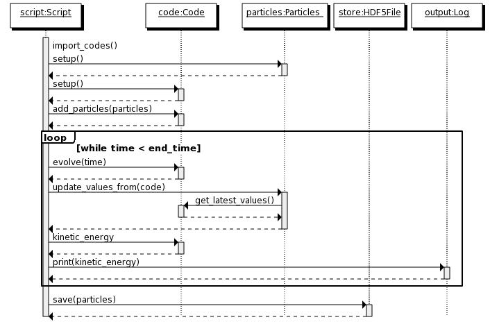

=====================
Architecture Overview
=====================

Layers
------
The AMUSE architecture is based on a layered design with 3 layers. 
The highest layer is a python script, written for a single problem
or set of problems. The next layer contains the AMUSE code, this layer
provides a library of objects and function to use in the python script. 
The last layer contains all the existing or legacy codes. In this layer
the physical models are implemented.

Each layer builds upon a lower layer, adding functionality or ease of
use to the previous layer:

.. raw:: latex

   \begin{figure}[htp] \centering
   
.. graphviz::
    
    digraph layers0 {
      fontsize=10.0;
      node [shape=box, style=filled, fillcolor=lightyellow, width=3];
      subgraph cluster0 {
            style=filled;
            color=azure2;
            labeljust="l";
            label="Layer 1";
            level1 [label = "User Script"];
      } 
      subgraph cluster1 {
            style=filled;
            color=azure2;
            labeljust="l";
            label="Layer 2";
            level2 [label = "AMUSE Library"];
      }
    
      subgraph cluster2 {
            style=filled;
            
            color=azure2;
            labeljust="l";
            label="Layer 3";
            level3 [label = "Community Codes"];
      }
      level1 -> level2 -> level3
    }

.. raw:: latex

   \caption{The 3 layers in AMUSE}
   \end{figure} 

Each layer has a different role in the AMUSE architecture:

1. **User Script layer**. The code in this layer implements a specific 
   physical problem or set of problems. This layer contains the 
   example scripts and scripts written by the user. This layer is 
   conceptually comparable to a User Interface layer in applications 
   with a GUI. Coupling two or more codes happens in this layer (with
   the help of support classes from the *AMUSE Library Layer*.

2. **AMUSE Library layer**. This layer provides an object oriented 
   interface on top of the legacy codes. It also provides a library
   of functionalities, such as unit handling and data conversion.
   The role of this layer is very generic, it is not specific 
   for one problem or for one physical domain.
   
3. **Community Codes layer**.  This layer defines the interfaces
   to the community codes and contains the actual codes. It provides 
   process management for the community codes and functional
   interfaces to these. The code in this layer is generic in 
   respect to problems, but specific for different physical domains.

The following sections contain a detailed explanation of the layers,
starting with the lowest layer to the highest. Some details are further
worked out in other chapters or in the reference manual.

Community codes layer
*********************

The **Community Codes layer** contains the actual applications and 
the functionality to communicate with these applications. This
layer exposes every community code as a set of functions. These 
functions are grouped in one class per code.

The AMUSE framework code and the community codes are designed to be run 
as separate applications. The AMUSE framework code consists of a python
script and the AMUSE library. The community codes consist of 
the original code-base of a scientific code extended with a 
new main application that handles messages send to it from 
the python library. 
Function calls into the community codes are send via a *message passing framework* 
to the actual running codes. 

.. raw:: latex

   \begin{figure}[htp] \centering

.. graphviz::

   digraph layers4 {
      fontsize=10.0;
        rankdir="LR";
        node [fontsize=10.0, shape=box, style=filled, fillcolor=lightyellow];
        subgraph cluster0 {
            style=filled;
            color=azure2;
            label="Application";
            
            "Python Interfaces";
        }
        "Message Passing Framework";
        subgraph cluster1 {
            style=filled;
            color=azure2;
            label="Application";
            "Community Code";
        }
        "Python Interfaces" -> "Message Passing Framework";
        "Community Code" -> "Message Passing Framework";
        
        "Message Passing Framework" -> "Community Code";
        "Message Passing Framework" -> "Python Interfaces";
    }

.. raw:: latex

   \caption{The AMUSE script and community codes are separate applications. The application
   communicate using a message passing framework}
   \end{figure} 

The number of applications started and the machines on which these
run can all be set dynamically in AMUSE. Depending on the problem
a researcher can run all of AMUSE on a single desktop computer
or in a mixed environment with clusters of computers. Every AMUSE run
starts with one python script. This script can in turn start
a number of different community codes (as separate applications).
A complete run can consist of multiple applications running in parallel
or in sequence and managed by one python script. 

.. graphviz::

   digraph multiples {
      fontsize=8.0;
        rankdir="LR";
        node [fontsize=8.0,shape=box, style=filled, fillcolor=lightyellow];
        subgraph cluster0 {
            style=filled;
            color=azure2;
            label="Application";
            
            "Python Script";
        }
        subgraph cluster1 {
            style=filled;
            color=azure2;
            label="Application, running on a GPU";
            "Gravitational Dynamics";
        }
        subgraph cluster2 {
            style=filled;
            color=azure2;
            label="Application, running on a cluster";
            "Hydrodynamics";
            "Hydrodynamics 1";
            "Hydrodynamics 2";
            "Hydrodynamics 3";
            "Hydrodynamics 4";
            "Hydrodynamics" -> "Hydrodynamics 1"
            "Hydrodynamics" -> "Hydrodynamics 2"
            "Hydrodynamics" -> "Hydrodynamics 3"
            "Hydrodynamics" -> "Hydrodynamics 4"
        }
        subgraph cluster3 {
            style=filled;
            color=azure2;
            label="Application";
            "Stellar Evolution 1";
        }
        subgraph cluster4 {
            style=filled;
            color=azure2;
            label="Application";
            "Stellar Evolution 2";
        }
        subgraph cluster5 {
            style=filled;
            color=azure2;
            label="Application";
            "Stellar Evolution 3";
        }
        subgraph cluster6 {
            style=filled;
            color=azure2;
            label="Application";
            "Stellar Evolution 4";
        }
        "Python Script" -> "Gravitational Dynamics";
        "Python Script" -> "Hydrodynamics";
        "Python Script" -> "Stellar Evolution 1";
        "Python Script" -> "Stellar Evolution 2";
        "Python Script" -> "Stellar Evolution 3";
        "Python Script" -> "Stellar Evolution 4";
        
    }

Message passing
~~~~~~~~~~~~~~~
The amuse framework interacts with legacy codes via a message passing
framework. Function calls in the python scripts are translated
to messages and these messages are send to the community codes 
using the message passing framework . The community codes wait 
for message events and will decode the message upon arrival and 
perform the requested function. The results will be send back 
using a similar message.

.. image:: message_passing.png

AMUSE Library layer
*******************

The **Library layer** is responsible for providing an object
oriented interface to the community codes. It also provides extra 
functionality to help write a user script, such as file input 
and output of common file formats and unit conversions. These
extra functionalities can be used independent of the community codes.

Every community code has a *low-level* interface (defined in the community
interface layer) and an *object-oriented* interface. The *low-level*
interface is defined as as set of functions. The *object-oriented* interface
uses these functions and combines these with models for state-transitions,
units and data sets to provide an interface that is easier to use (less error
prone) and easier to couple with other codes.

.. graphviz::

    digraph amcode_0{
      fontsize=10.0;
        compound=true;
        ranksep=1;
        
        node [fontsize=10.0,shape=box, style=filled, fillcolor=lightyellow];
        subgraph cluster0 {
            style=filled;
            color=azure2;
            label="Object Oriented Interface";
            "Unit Conversion";
            "Code Interface";
            "State";
            "Exceptions";
        }
        
        subgraph cluster1 {
            style=filled;
            color=azure2;
            label="Data Model";
            "Particles" ;
            "Grid Points";
        }
        "Legacy Interface";
        "Code Interface" -> "Community Code Interface"[ ltail=cluster0];
        subgraph cluster2 {
            style=filled;
            color=azure2;
            label="Support";
            
            "Input/Ouput";
            "Units";
        }
        
        "Code Interface" -> "Particles"[lhead=cluster1, ltail=cluster0]; 
        "Code Interface" -> "Units"[lhead=cluster2, ltail=cluster0]; 
    }

Model of a community code
~~~~~~~~~~~~~~~~~~~~~~

The community codes of every module in all physical domains are modelled using
the same template. The template consists of attributes and wrappers. **Attributes**
provide a common interface for sub-parts of the code, for example the *particles*
attribute provides an interface to add, update and remove the particles in
a code. Attributes combine several functions in a legacy interface into
one object.  **Wrappers** are defined on top of the community functions and
add functionality to existing methods. For example for every method 
the units of the arguments and return values can be defined in a filter.
Wrappers add functionality to individual methods.

Attributes
++++++++++
The template divides the interface object of a code into
a number of attributes. Each attribute refers to an object implementing
a specific sub-interface of the code. For example a code can have a
*parameter* attribute, this attribute implements the *ParameterSet* 
sub-interface. The *ParameterSet* sub-interface defines how to
interact with the parameters of a code (in this case each parameter
can be set or queried from the set by name using normal python attribute access).

The *template* for all codes is divided into the following sub-interfaces:

parameters
    Parameters influence how the code works. Parameters are usually
    set just after creating a code. Parameters should be read-write
    or write-only.
    
properties
    Properties inform the user about the state of the code. The
    current model time is a property. Properties are always read-only.

particle sets
    Particle sets provide a common interface for a set of particles
    in the code. A code can have multiple particle sets defined under
    different names (for example gas, stars and dark matter)

grids
    Grids provide access to multi-dimensional data. A code can
    have multiple grids defined in a hierarchy (for AMR or SMR codes)

Wrappers
++++++++

Wrappers decorate a method. Wrappers can do pre- and post-processing of
the arguments or decide if a method can savely be called.

units and error code
    Defines a unit for each argument of the wrapped method. When called
    the arguments will be converted to numbers in the correct unit. The
    return values will be converted to quantities (numbers with a unit).
    
state
    The state of a code determines which functions are valid to call
    and how the code can transfer from one state into another. For example, 
    a code might give incorrect answers if the potential energy is requested before
    the particles are entered into the code, the state model will rais an error to
    inform the script writer of this problem.
    
Implementation
++++++++++++++

The implementation of the *object-oriented* interface is based on the adaptor 
pattern. A *Community Code Interface* class is adapted to create a
class which provides *"parameters"*, *"particle sets/gridpoints"* , 
*"methods with units"* , *"properties with units"* , 
*"state control"* and *"Unit conversions for incompatible unit systems"*. 
Each functionality has the same interface for all codes in the system.

.. raw:: latex

   \begin{figure}[htp] \centering
   
.. graphviz::

    digraph amcode_1{
      fontsize=10.0;
        compound=true;
        ranksep=1.0;
        rankdir="LR";
        node [fontsize=10.0,shape=box, style=filled, fillcolor=lightyellow];
        subgraph cluster1 {
            style=filled;
            color=azure2;
            label="Adaptor";
            labelloc="b";
            labeljust="r";
            "Particles or Gridpoints"
            "Parameters"
            "Methods with Units"
            "Properties with Units"
            "State control"
            "Unit conversions for incompatible unit systems"
        }
        "Community Code Interface"
        "Community Code Interface"->"Particles or Gridpoints"[lhead=cluster1];
    }

.. raw:: latex

   \caption{A legacy interface is adapted to provide an object
   oriented interface and more functionality.}
   \end{figure} 

User Script
***********

The final layer is the **User Script Layer** this layer contains 
all the scripts written by a researcher for a specific 
problem or set of problems. These scripts are always written
in *python* and can use all the functionality provided by the two
lower layers in the AMUSE framework. The scripts don't need to 
follow a fixed design.

